# 基于Socket接口实现自定义协议通信

> 实验名称： 基于Socket接口实现自定义协议通信 
> 实验类型： 编程实验 
> 同组学生： 林子昕 3220103784，佟昕 3220101844 
> 实验平台： Linux，MacOS 操作系统

<!-- 客户端和服务端的代码分别在 client 和 server 目录

- `make` 编译，生成的文件在 build 目录
- `make run` 运行
- `make clean` 清理编译生成的文件 -->

# 实验报告

## 一、实验目的
- 学习如何设计网络应用协议。
- 掌握Socket编程接口，编写基本的网络应用软件。

## 二、实验内容
根据自定义的协议规范，使用Socket编程接口开发基本的网络应用软件。

### 实验要求
- 掌握C语言形式的Socket编程接口用法，能够正确发送和接收网络数据包。
- 开发一个客户端，实现人机交互界面和与服务器的通信。
- 开发一个服务端，实现并发处理多个客户端的请求。
- 程序界面不作要求，可采用命令行或最简单的窗体。

### 功能要求
1. **运输层协议**：采用TCP。
2. **客户端功能**：交互菜单形式，用户可选择以下操作：
   - **连接**：请求连接到指定地址和端口的服务端。
   - **断开连接**：断开与服务端的连接。
   - **获取时间**：请求服务端返回当前时间。
   - **获取名字**：请求服务端返回其机器的名称。
   - **活动连接列表**：请求服务端返回当前连接的所有客户端信息（编号、IP地址、端口等）。
   - **发消息**：请求服务端转发消息给指定编号的客户端，该客户端收到后显示消息。
   - **退出**：断开连接并退出客户端程序。

3. **服务端功能**：响应客户端请求并完成以下任务：
   - 返回服务端所在机器的当前时间。
   - 返回服务端所在机器的名称。
   - 返回当前连接的所有客户端信息。
   - 将某客户端发送的内容转发给指定编号的其他客户端。
   - 采用异步多线程编程模式，正确处理多个客户端同时连接及消息发送。

### 开发说明
- 设计客户端和服务端之间的通信协议。
- 网络数据包发送部分必须使用底层C/C++语言形式的Socket API，禁止使用任何Socket封装类。
- 本实验可组队完成，每组最多2人，鼓励独立完成。

---

## 三、主要仪器设备
- **硬件**：联网的PC机。
- **软件**：
  - Wireshark软件。
  - Visual C++、GCC等C++集成开发环境。

## 四、操作方法与实验步骤

### 1. 数据包设计
设计请求、指示（服务器主动发给客户端的）、响应数据包的格式，至少考虑以下问题：
- **边界识别**：定义两个数据包的边界如何识别。
- **类型字段**：定义数据包的请求、指示、响应类型字段。
- **长度字段**：定义数据包的长度字段或结尾标记。
- **数据字段格式**：定义数据包内数据字段的格式，特别是客户端列表数据的表达方式。

### 2. 小组分工
- 佟昕 负责服务端的编写。
- 林子昕 负责客户端的编写。
- 同时，我们在数据结构、功能模块的完善上，进行了有效的沟通与合作，并且采用 [git 仓库](https://github.com/AnyaReese/Socket)管理代码版本以及协作。

### 3. 客户端编写步骤
客户端需要采用多线程模式，具体步骤如下：
#### a) 初始化
- 调用 `socket()` 向操作系统申请Socket句柄。

#### b) 菜单功能
- 编写菜单，列出以下7个选项：
  - **连接**
  - **断开连接**
  - **获取时间**
  - **获取名字**
  - **活动连接列表**
  - **发送消息**
  - **退出**

#### c) 等待用户选择
- 根据用户选择执行相应操作（未连接时只能选择连接和退出功能）。

#### d) 具体功能实现
1. **连接**：
   - 用户输入服务器IP和端口。
   - 调用 `connect()` 并等待结果，连接成功后设置状态为已连接。
   - 创建接收数据的子线程，循环调用 `receive()`，收到完整响应包后通过线程通信传给主线程。
2. **断开连接**：
   - 调用 `close()` 关闭连接，设置状态为未连接。
   - 通知并等待子线程关闭。
3. **获取时间**：
   - 组装时间请求数据包。
   - 调用 `send()` 发送请求并等待子线程返回结果。
   - 打印响应中的时间信息。
4. **获取名字**：
   - 组装名字请求数据包。
   - 调用 `send()` 发送请求并等待子线程返回结果。
   - 打印响应中的名字信息。
5. **获取客户端列表**：
   - 组装列表请求数据包。
   - 调用 `send()` 发送请求并等待子线程返回结果。
   - 打印客户端列表（编号、IP地址、端口等）。
6. **发送消息**：
   - 用户输入目标客户端编号和内容。
   - 组装消息请求数据包。
   - 调用 `send()` 发送请求并等待子线程返回结果。
   - 打印发送结果。
7. **退出**：
   - 若已连接，先调用断开功能。
   - 退出程序。

#### e) 主线程任务
- 等待用户输入。
- 处理子线程消息队列，打印响应或指示消息。

### 4. 服务端编写步骤
服务端需要采用多线程模式，具体步骤如下：

#### a) 初始化
- 调用 `socket()` 向操作系统申请Socket句柄。
- 调用 `bind()` 绑定监听端口（使用学号后4位）。
- 调用 `listen()` 设置连接等待队列长度。

#### b) 主线程任务
- 循环调用 `accept()`，为新客户端创建子线程。
- 子线程处理逻辑：
  - 可选发送 `hello` 消息给客户端。
  - 循环调用 `receive()`，根据请求类型完成任务：
    1. **获取时间**：调用 `time()` 获取时间，组装响应包并 `send()` 返回。
    2. **获取名字**：将服务器名字组装入响应包并 `send()` 返回。
    3. **获取客户端列表**：组装列表数据入响应包并 `send()` 返回。
    4. **发送消息**：
       - 检查编号是否存在及状态是否连接。
       - 若失败，返回错误代码；若成功，转发消息给目标客户端。

#### c) 退出检测
- 主线程检测退出信号，通知并等待子线程退出。
- 关闭Socket，程序结束。

### 5. 功能验证
- 客户端与服务端程序运行，检查功能实现情况。
- 修复问题直至满足功能要求。
- 使用多个客户端同时连接服务端，验证并发处理能力。
- 使用Wireshark抓取各功能的交互数据包。

## 五、实验数据记录和处理

请将以下内容与实验报告一起打包成一个压缩文件上传：
- **源代码**：客户端和服务端的代码分别放置在不同目录，代码需包含较为丰富的注释。
- **可执行文件**：提供客户端和服务端的可运行文件（`.exe` 或 Linux 可执行文件），并附简易运行说明文档。

### 实验记录
以下记录需结合屏幕截图，配以文字标注：

#### 1. 请求数据包

描述格式：
请求数据包由客户端发给服务端，用于传递客户端的请求信息，包含以下字段：
- **`request`** (1字节): 请求类型，例如获取时间、获取名字、客户端列表等。
- **`target_addr`** (1字节): 目标客户端地址，仅在发送消息功能中使用。
- **`size`** (1字节): 消息内容的长度。
- **`message`** (256字节): 可选的消息内容，取决于请求类型。

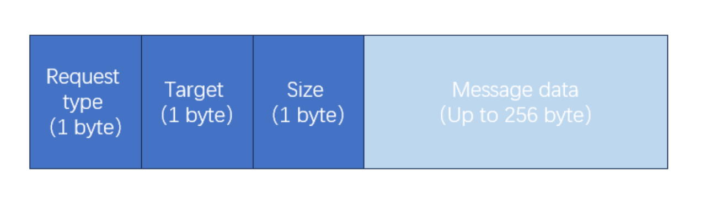

#### 2. 响应数据包

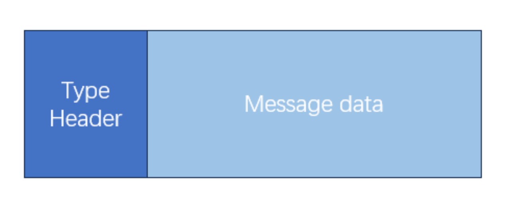

从服务端发回来的数据包会被解析为一个`ThreadMessage`，包括：
- `type`：消息的类型，可以是`RESPONSE`或`NOTIFICATION`，同时，对于额外设置了 `[SHUTDOWN]` 字段特殊处理Server端断开连接的处理
- `content`：消息的具体内容，例如服务器返回的数据或通知的具体信息。
- `sender_ip`：发送者的IP地址，用于标识消息的来源。
- `sender_id`：发送者的唯一标识符或ID，用于区分不同的客户端或服务器。

#### 3. 指示数据包

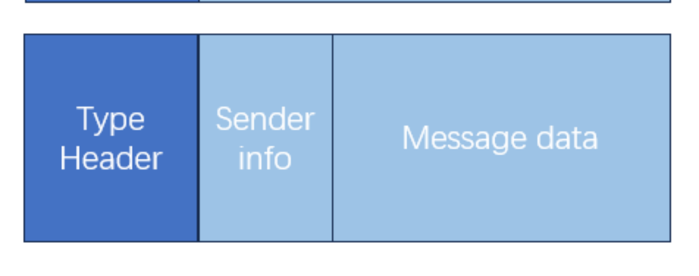

从服务端发回来的数据包会被解析为一个`ThreadMessage`，包括：
- `type`：消息的类型，可以是`RESPONSE`或`NOTIFICATION`，同时，对于额外设置了 `[SHUTDOWN]` 字段特殊处理Server端断开连接的处理
- `content`：消息的具体内容，例如服务器返回的数据或通知的具体信息。
- `sender_ip`：发送者的IP地址，用于标识消息的来源。
- `sender_id`：发送者的唯一标识符或ID，用于区分不同的客户端或服务器。

#### 4. 客户端初始运行后显示的菜单选项。

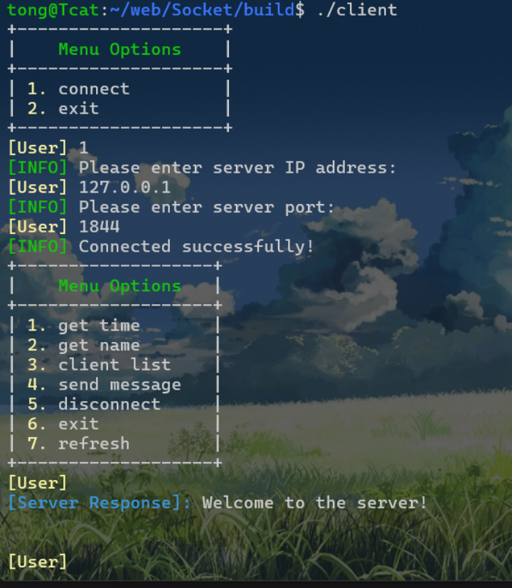

#### 5. 客户端的主线程循环关键代码（描述总体，省略细节部分）。

主线程循环的关键代码主要负责显示菜单、接收用户输入、处理用户命令，并根据用户的选择执行相应的操作：
- 显示菜单：根据客户端是否已连接到服务器，显示不同的菜单选项。
- 接收用户输入：提示用户输入选择的命令。
- 命令处理：如果用户未连接到服务器，根据用户选择执行连接操作或退出。

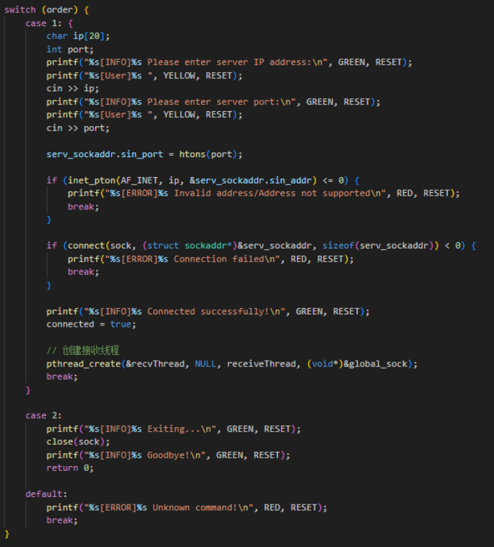

如果用户已连接，根据用户选择执行一项操作（`get time`等）

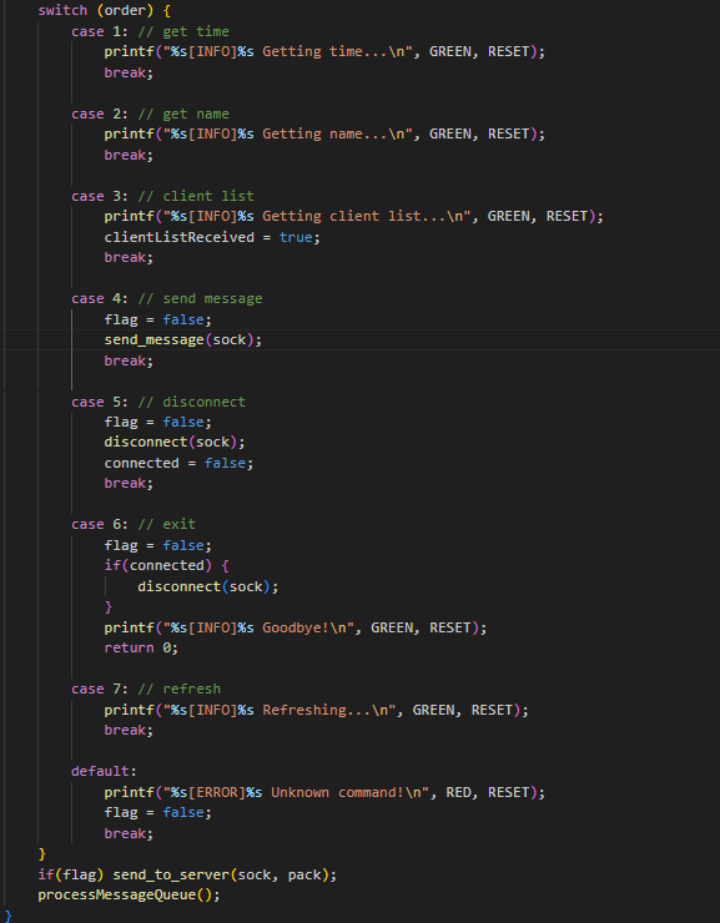

**发送请求**：对于某些命令，如获取时间或名称，构造请求数据包并发送到服务器。

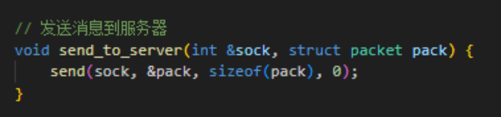

**处理消息队列**：从消息队列中取出消息，并根据消息类型进行处理，如显示服务器响应或客户端消息。

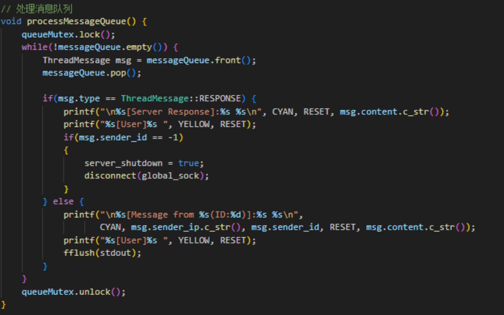

**循环继续**：循环回到显示菜单步骤，等待下一次用户输入。

#### 6. 客户端的接收数据子线程循环关键代码（描述总体，省略细节部分）。

接收数据子线程的主要任务是持续监听来自服务器的数据，并将其放入消息队列中：
- 线程运行标志检查：在循环开始时，检查`threadRunning`标志，如果为`false`，则退出循环。
- 接收数据：使用`recv`函数从套接字中接收数据，存储到缓冲区中。
- 数据解析：如果接收到的数据包含特定通知（如`[NOTIFICATION]`），则解析出发送者IP、ID和消息内容，创建`ThreadMessage`实例，并设置为`NOTIFICATION`类型。
- 如果接收到的数据是服务器响应（如`[RESPONSE]`或`[SHUTDOWN]`），则直接将整个响应内容设置为`ThreadMessage`的`content`，并设置为`RESPONSE`类型。
- 消息入队：将解析后的`ThreadMessage`实例加锁后放入消息队列`messageQueue`中。
- 处理消息队列：调用`processMessageQueue`函数来处理队列中的消息，显示给用户或执行其他必要的操作。
- 循环继续：返回循环的开始，继续监听来自服务器的数据。

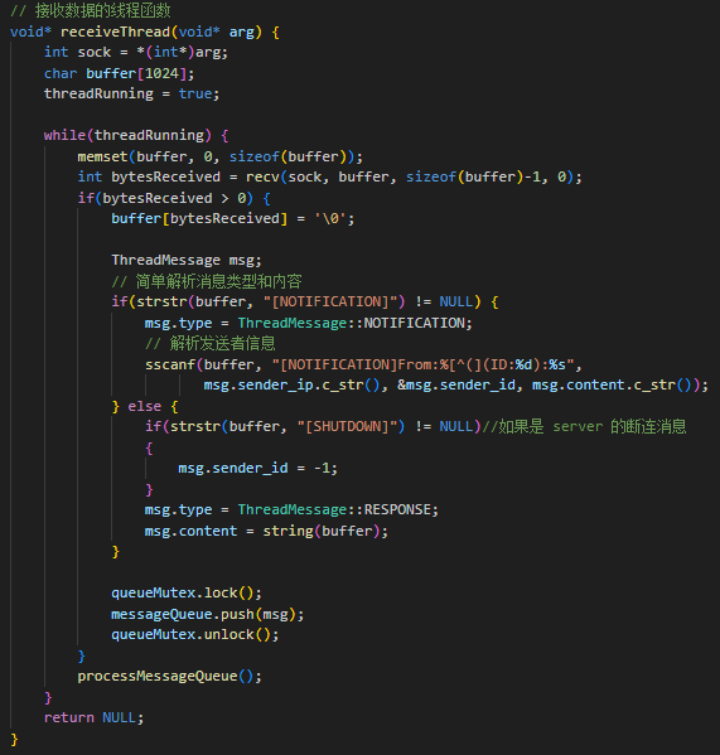

7. **服务器初始运行后显示的界面**。

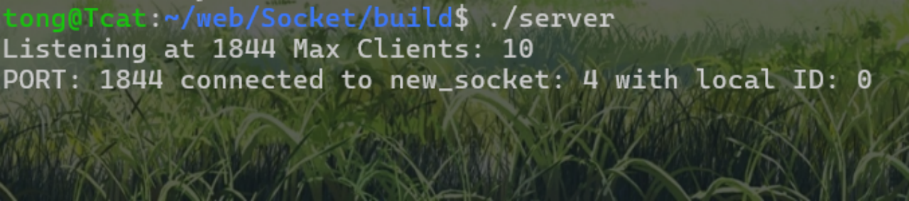

8. **服务器的主线程循环关键代码**（描述总体，省略细节部分）。

服务器的主线程循环负责接受新的客户端连接和监控服务器的运行状态。以下是主线程循环的关键代码的总体描述：
- 初始化套接字数组：将用于存储客户端套接字的数组sockets初始化为-1，表示所有客户端套接字初始时都是空闲的。
- 设置信号处理：通过signal函数设置信号处理程序signal_handler，以便在接收到中断信号（如SIGINT和SIGTERM）时能够优雅地关闭服务器。
- 创建服务器套接字：创建服务器套接字server_fd，并设置其为非阻塞模式，允许地址重用。
- 绑定和监听：将服务器套接字绑定到指定端口，并开始监听该端口上的连接请求。

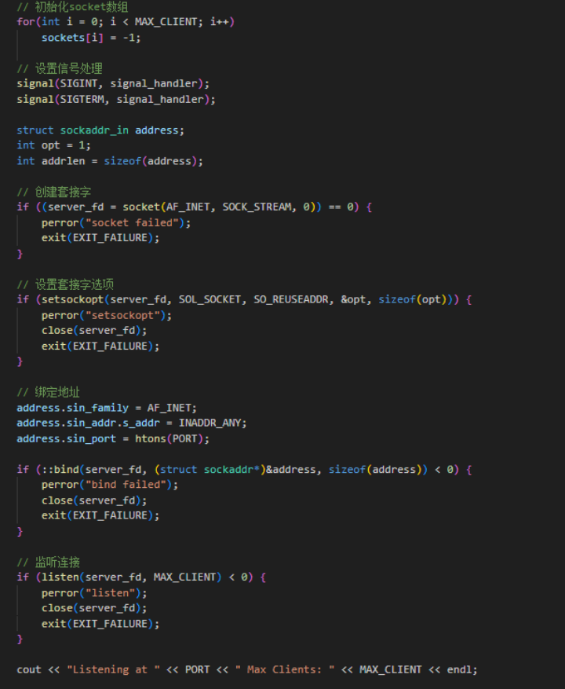

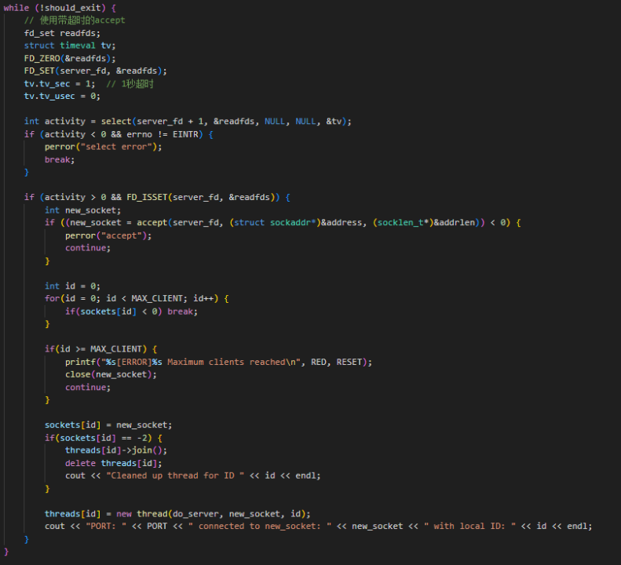

- 监控退出条件：在主循环中，监控should_exit原子变量，如果它被设置为true（通常由信号处理函数设置），则跳出循环，开始关闭服务器。
- 关闭服务器：循环结束后，关闭服务器套接字，并等待所有子线程结束，清理线程资源，然后退出主线程

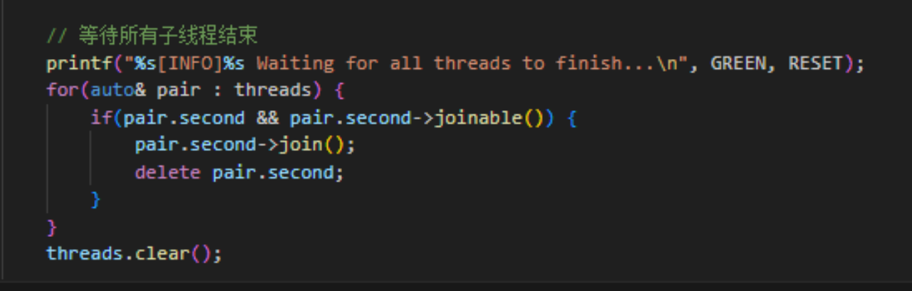

9. **服务器的客户端处理子线程循环关键代码**（描述总体，省略细节部分）。

服务器的客户端处理子线程循环负责接收和处理来自特定客户端的请求，包括获取时间、服务器名称、客户端列表、发送消息给其他客户端以及断开连接等操作，同时监控服务器的退出信号以确保在必要时能够优雅地关闭连接并释放资源。

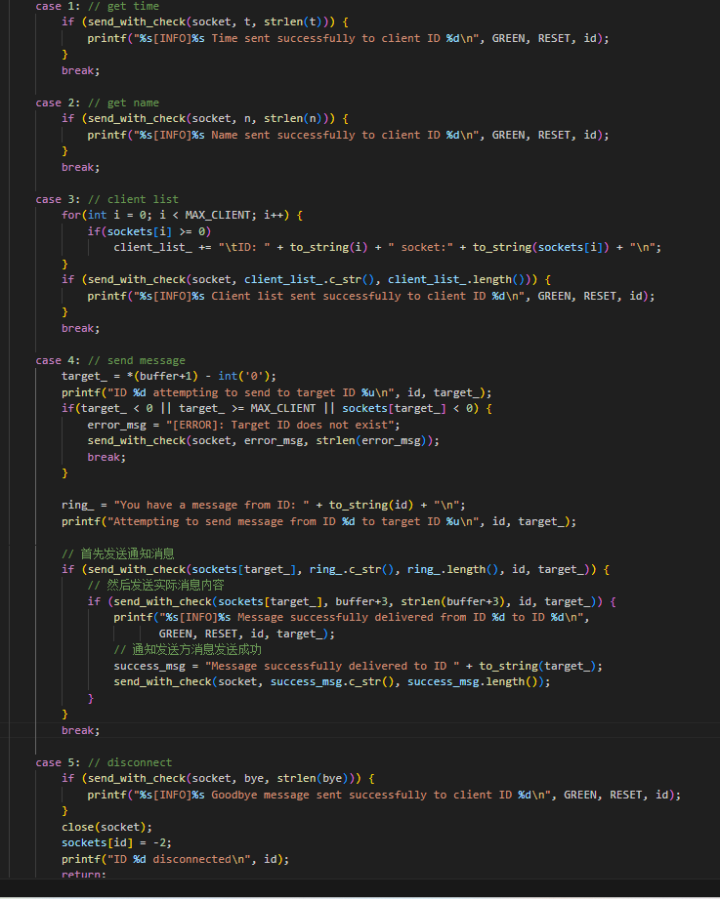

10. **功能操作与显示内容**：
    - **连接功能**：
      - 截图客户端和服务端显示的内容。
      - 使用 Wireshark 抓取相关数据包。

    - **获取时间功能**：
      - 客户端和服务端显示内容截图。
      - Wireshark 抓取数据包截图，展开应用层数据包，标记请求、响应类型及时间数据对应位置。

    - **获取名字功能**：
      - 客户端和服务端显示内容截图。
      - Wireshark 抓取数据包截图，展开应用层数据包，标记请求、响应类型及名字数据对应位置。
      - 相关服务器处理代码片段。

    - **获取客户端列表功能**：
      - 客户端和服务端显示内容截图。
      - Wireshark 抓取数据包截图，展开应用层数据包，标记请求、响应类型及客户端列表数据对应位置。
      - 相关服务器处理代码片段。

    - **发送消息功能**：
      - **发送消息的客户端显示内容截图**。
      - **服务器显示内容截图**。
      - **接收消息的客户端显示内容截图**。
      - Wireshark 抓取数据包截图，分别标记发送和接收数据包。
      - 相关服务器和客户端代码片段。

11. **异常情况测试**：
    - **拔掉客户端网线**：
      - 客户端退出时的TCP连接状态。
      - 使用 Wireshark 观察是否发送 TCP 连接释放消息。
      - 服务端的 TCP 连接状态在10分钟内是否变化。

    - **重新连接**：
      - 连上网线后重新运行客户端，连接并获取客户端列表，查看异常退出的连接状态。
      - 发送消息给异常退出的客户端时，观察结果。

    - **修改请求频率**：
      - 将获取时间功能改为自动发送100次请求。
      - 检查服务器是否正常处理，客户端是否接收到100次响应，使用 Wireshark 抓取数据包。

    - **并发测试**：
      - 多个客户端同时连接服务器，并自动连续发送时间请求100次。
      - 截图服务器和客户端运行结果。

---

## 六、实验结果与分析

回答以下问题：

1. **客户端是否需要调用 `bind` 操作？**
   - 它的源端口是如何产生的？
   - 每次调用 `connect` 时客户端的端口是否保持不变？

2. **调试断点测试**：
   - 如果在服务端 `listen` 和 `accept` 之间设置断点，客户端调用 `connect` 是否能马上连接成功？

3. **快速发送数据**：
   - 连续快速 `send` 多次数据后，通过 Wireshark 抓包，发送的 TCP Segment 次数是否与 `send` 的次数一致？

4. **数据包区分**：
   - 服务端在同一端口接收多个客户端的数据，如何区分数据包所属客户端？

5. **TCP连接状态**：
   - 客户端主动断开连接后，TCP连接状态是什么？持续时间是多少？（可用 `netstat -an` 查看）

6. **异常断网处理**：
   - 客户端断网后异常退出，服务端的TCP连接状态是否变化？
   - 服务端如何检测连接是否有效？

---

## 七、讨论与心得

记录实验过程中遇到的困难、经验教训，以及对实验安排的建议。

