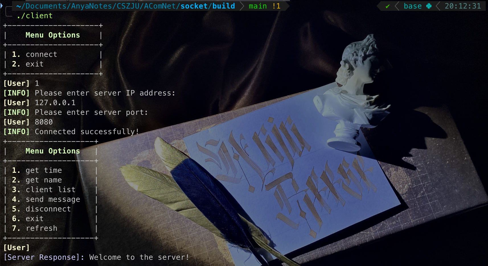

# 基于Socket接口实现自定义协议通信

> 实验名称： 基于Socket接口实现自定义协议通信</br>
> 实验类型： 编程实验</br>
> 同组学生： 林子昕 3220103784，佟昕 322xxx</br>
> 实验平台： Linux，MacOS 操作系统

<!-- 客户端和服务端的代码分别在 client 和 server 目录

- `make` 编译，生成的文件在 build 目录
- `make run` 运行
- `make clean` 清理编译生成的文件 -->

# 实验报告

## 一、实验目的
- 学习如何设计网络应用协议。
- 掌握Socket编程接口，编写基本的网络应用软件。

## 二、实验内容
根据自定义的协议规范，使用Socket编程接口开发基本的网络应用软件。

### 实验要求
- 掌握C语言形式的Socket编程接口用法，能够正确发送和接收网络数据包。
- 开发一个客户端，实现人机交互界面和与服务器的通信。
- 开发一个服务端，实现并发处理多个客户端的请求。
- 程序界面不作要求，可采用命令行或最简单的窗体。

### 功能要求
1. **运输层协议**：采用TCP。
2. **客户端功能**：交互菜单形式，用户可选择以下操作：
   - **连接**：请求连接到指定地址和端口的服务端。
   - **断开连接**：断开与服务端的连接。
   - **获取时间**：请求服务端返回当前时间。
   - **获取名字**：请求服务端返回其机器的名称。
   - **活动连接列表**：请求服务端返回当前连接的所有客户端信息（编号、IP地址、端口等）。
   - **发消息**：请求服务端转发消息给指定编号的客户端，该客户端收到后显示消息。
   - **退出**：断开连接并退出客户端程序。

3. **服务端功能**：响应客户端请求并完成以下任务：
   - 返回服务端所在机器的当前时间。
   - 返回服务端所在机器的名称。
   - 返回当前连接的所有客户端信息。
   - 将某客户端发送的内容转发给指定编号的其他客户端。
   - 采用异步多线程编程模式，正确处理多个客户端同时连接及消息发送。

### 开发说明
- 设计客户端和服务端之间的通信协议。
- 网络数据包发送部分必须使用底层C/C++语言形式的Socket API，禁止使用任何Socket封装类。
- 本实验可组队完成，每组最多2人，鼓励独立完成。

---

## 三、主要仪器设备
- **硬件**：联网的PC机。
- **软件**：
  - Wireshark软件。
  - Visual C++、GCC等C++集成开发环境。

## 四、操作方法与实验步骤

### 1. 数据包设计
设计请求、指示（服务器主动发给客户端的）、响应数据包的格式，至少考虑以下问题：
- **边界识别**：定义两个数据包的边界如何识别。
- **类型字段**：定义数据包的请求、指示、响应类型字段。
- **长度字段**：定义数据包的长度字段或结尾标记。
- **数据字段格式**：定义数据包内数据字段的格式，特别是客户端列表数据的表达方式。

### 2. 小组分工
- 佟昕 负责服务端的编写。
- 林子昕 负责客户端的编写。
- 同时，我们在数据结构、功能模块的完善上，进行了有效的沟通与合作，并且采用 [git 仓库](https://github.com/AnyaReese/Socket)管理代码版本以及协作。

### 3. 客户端编写步骤
客户端需要采用多线程模式，具体步骤如下：
#### a) 初始化
- 调用 `socket()` 向操作系统申请Socket句柄。

#### b) 菜单功能
- 编写菜单，列出以下7个选项：
  - **连接**
  - **断开连接**
  - **获取时间**
  - **获取名字**
  - **活动连接列表**
  - **发送消息**
  - **退出**

#### c) 等待用户选择
- 根据用户选择执行相应操作（未连接时只能选择连接和退出功能）。

#### d) 具体功能实现
1. **连接**：
   - 用户输入服务器IP和端口。
   - 调用 `connect()` 并等待结果，连接成功后设置状态为已连接。
   - 创建接收数据的子线程，循环调用 `receive()`，收到完整响应包后通过线程通信传给主线程。
2. **断开连接**：
   - 调用 `close()` 关闭连接，设置状态为未连接。
   - 通知并等待子线程关闭。
3. **获取时间**：
   - 组装时间请求数据包。
   - 调用 `send()` 发送请求并等待子线程返回结果。
   - 打印响应中的时间信息。
4. **获取名字**：
   - 组装名字请求数据包。
   - 调用 `send()` 发送请求并等待子线程返回结果。
   - 打印响应中的名字信息。
5. **获取客户端列表**：
   - 组装列表请求数据包。
   - 调用 `send()` 发送请求并等待子线程返回结果。
   - 打印客户端列表（编号、IP地址、端口等）。
6. **发送消息**：
   - 用户输入目标客户端编号和内容。
   - 组装消息请求数据包。
   - 调用 `send()` 发送请求并等待子线程返回结果。
   - 打印发送结果。
7. **退出**：
   - 若已连接，先调用断开功能。
   - 退出程序。

#### e) 主线程任务
- 等待用户输入。
- 处理子线程消息队列，打印响应或指示消息。

### 4. 服务端编写步骤
服务端需要采用多线程模式，具体步骤如下：

#### a) 初始化
- 调用 `socket()` 向操作系统申请Socket句柄。
- 调用 `bind()` 绑定监听端口（使用学号后4位）。
- 调用 `listen()` 设置连接等待队列长度。

#### b) 主线程任务
- 循环调用 `accept()`，为新客户端创建子线程。
- 子线程处理逻辑：
  - 可选发送 `hello` 消息给客户端。
  - 循环调用 `receive()`，根据请求类型完成任务：
    1. **获取时间**：调用 `time()` 获取时间，组装响应包并 `send()` 返回。
    2. **获取名字**：将服务器名字组装入响应包并 `send()` 返回。
    3. **获取客户端列表**：组装列表数据入响应包并 `send()` 返回。
    4. **发送消息**：
       - 检查编号是否存在及状态是否连接。
       - 若失败，返回错误代码；若成功，转发消息给目标客户端。

#### c) 退出检测
- 主线程检测退出信号，通知并等待子线程退出。
- 关闭Socket，程序结束。

### 5. 功能验证
- 客户端与服务端程序运行，检查功能实现情况。
- 修复问题直至满足功能要求。
- 使用多个客户端同时连接服务端，验证并发处理能力。
- 使用Wireshark抓取各功能的交互数据包。

## 五、实验数据记录和处理

请将以下内容与实验报告一起打包成一个压缩文件上传：
- **源代码**：客户端和服务端的代码分别放置在不同目录，代码需包含较为丰富的注释。
- **可执行文件**：提供客户端和服务端的可运行文件（`.exe` 或 Linux 可执行文件），并附简易运行说明文档。

### 实验记录
以下记录需结合屏幕截图，配以文字标注：

#### 1. 请求数据包

描述格式：
请求数据包由客户端发给服务端，用于传递客户端的请求信息，包含以下字段：
- **`request`** (1字节): 请求类型，例如获取时间、获取名字、客户端列表等。
- **`target_addr`** (1字节): 目标客户端地址，仅在发送消息功能中使用。
- **`size`** (1字节): 消息内容的长度。
- **`message`** (256字节): 可选的消息内容，取决于请求类型。

绘图说明
```
+-----------+--------------+-------+--------------------------------------+
| Request   | Target Addr  | Size  | Message                              |
+-----------+--------------+-------+--------------------------------------+
| 1 byte    | 1 byte       | 1 byte| Up to 256 bytes                      |
+-----------+--------------+-------+--------------------------------------+
```

定义请求类型
- **1**: 获取时间。
- **2**: 获取名字。
- **3**: 获取客户端列表。
- **4**: 发送消息。
- **5**: 断开连接。

---

#### 2.响应数据包
描述格式
响应数据包由服务端发回客户端，用于返回请求的结果，包含以下字段：
- **`response_code`** (1字节): 响应类型，例如成功、失败。
- **`data`**: 返回的数据内容，可变长度。

绘图说明
```
+-----------------+--------------------------------+
| Response Code   | Data                           |
+-----------------+--------------------------------+
| 1 byte          | Variable-length data          |
+-----------------+--------------------------------+
```

定义响应类型
- **0**: 成功。
- **1**: 失败。
- **其他类型**: 特殊处理，例如服务器断连。

#### 3. 指示数据包
描述格式
指示数据包由服务端主动发送给客户端，用于通知客户端事件（例如新消息），包含以下字段：
- **`instruction_code`** (1字节): 指示类型，例如新消息通知。
- **`source_id`** (1字节): 消息发送者的ID。
- **`data`**: 通知的内容，可变长度。

绘图说明
```
+------------------+------------+-------------------------------+
| Instruction Code | Source ID  | Data                          |
+------------------+------------+-------------------------------+
| 1 byte           | 1 byte     | Variable-length data         |
+------------------+------------+-------------------------------+
```

定义指示类型
- **1**: 新消息通知。
- **2**: 服务器状态更新通知。

4. **客户端初始运行后显示的菜单选项**。



<!--我图片暂时放在本地还没挂上去-->

5. **客户端的主线程循环关键代码**（描述总体，省略细节部分）。

主循环逻辑

    1. 检查服务器状态：
       - 如果服务器关闭（`server_shutdown`），重置连接状态为未连接。
    2. 已连接：
       - 显示功能菜单，等待用户选择操作。
       - 根据选择执行对应操作（如获取时间、发送消息、断开连接等）。
       - 处理接收线程传来的服务器响应和通知。
    3. 未连接：
       - 创建套接字并显示初始菜单（仅支持连接或退出）。
       - 用户选择连接时，输入服务器IP和端口，尝试连接。
       - 如果连接成功，启动接收线程。
    4. 循环持续：
       - 循环运行，直到用户选择退出程序。

```cpp
while (true) {
    if (server_shutdown) {
        connected = false;
        server_shutdown = false;
    }

    if (connected) {
        cout << menu2;
        cin >> order;
        struct packet pack = {0, 0, 0, ""};
        pack.request = order;
        switch (order) {
            case 1: // Get time
                printf("[INFO] Getting time...\n");
                break;
            case 4: // Send message
                send_message(sock);
                break;
            case 5: // Disconnect
                disconnect(sock);
                connected = false;
                break;
            case 6: // Exit
                if (connected) disconnect(sock);
                return 0;
            default:
                printf("[ERROR] Unknown command!\n");
                break;
        }
        send_to_server(sock, pack);
        processMessageQueue();
    } else {
        sock = socket(AF_INET, SOCK_STREAM, 0);
        if (sock < 0) {
            printf("[ERROR] Socket creation failed\n");
            return -1;
        }
        global_sock = sock;
        cout << menu1;
        cin >> order;
        if (order == 1) { // Connect
            // Connect to server logic
        } else if (order == 2) { // Exit
            close(sock);
            return 0;
        } else {
            printf("[ERROR] Unknown command!\n");
        }
    }
}
```

6. **客户端的接收数据子线程循环关键代码**（描述总体，省略细节部分）。

主要功能
- 持续监听服务器消息：
  - 在循环中调用 `recv()` 方法接收服务器发送的数据。
  - 解析接收到的数据并根据类型（响应或通知）分类处理。
- 将处理后的消息加入消息队列：
  - 使用线程安全的队列（`messageQueue`）存储消息，供主线程读取和显示。
- 检查线程运行状态：
  - 根据线程控制标志（`threadRunning`）判断是否继续接收数据。
  - 如果线程结束或服务器关闭，退出循环。

关键代码片段：
```cpp
void* receiveThread(void* arg) {
    int sock = *(int*)arg;
    char buffer[1024];
    threadRunning = true;  // 标记线程正在运行
    
    while (threadRunning) {
        memset(buffer, 0, sizeof(buffer));  // 清空接收缓冲区
        int bytesReceived = recv(sock, buffer, sizeof(buffer) - 1, 0);  // 接收数据
        
        if (bytesReceived > 0) {
            buffer[bytesReceived] = '\0';  // 确保数据以字符串形式结束
            
            ThreadMessage msg;
            if (strstr(buffer, "[NOTIFICATION]") != NULL) {  // 判断是否为通知消息
                msg.type = ThreadMessage::NOTIFICATION;
                // 解析发送者信息
                sscanf(buffer, "[NOTIFICATION]From:%[^(](ID:%d):%s", 
                       msg.sender_ip.c_str(), &msg.sender_id, msg.content.c_str());
            } else {
                if (strstr(buffer, "[SHUTDOWN]") != NULL)  // 如果是服务器关闭通知
                    msg.sender_id = -1;
                msg.type = ThreadMessage::RESPONSE;  // 处理为响应消息
                msg.content = string(buffer);
            }
            
            queueMutex.lock();  // 加锁保证线程安全
            messageQueue.push(msg);  // 将消息加入队列
            queueMutex.unlock();
        }
        
        processMessageQueue();  // 调用函数处理队列中的消息
    }
    
    return NULL;
}
```

    1. 数据接收：
       - 使用 `recv()` 循环从服务器接收数据包。
    2. 数据解析：
       - 判断是通知消息还是响应消息，并提取相关内容。
    3. 消息存储：
       - 加锁后将消息存入线程安全队列，供主线程读取。
    4. 线程控制：
       - 根据 `threadRunning` 标志决定是否继续运行，如果线程标志变为 `false`，退出循环。
   
7. **服务器初始运行后显示的界面**。

8. **服务器的主线程循环关键代码**（描述总体，省略细节部分）。

9. **服务器的客户端处理子线程循环关键代码**（描述总体，省略细节部分）。

10. **功能操作与显示内容**：
    - **连接功能**：
      - 截图客户端和服务端显示的内容。
      - 使用 Wireshark 抓取相关数据包。

    - **获取时间功能**：
      - 客户端和服务端显示内容截图。
      - Wireshark 抓取数据包截图，展开应用层数据包，标记请求、响应类型及时间数据对应位置。

    - **获取名字功能**：
      - 客户端和服务端显示内容截图。
      - Wireshark 抓取数据包截图，展开应用层数据包，标记请求、响应类型及名字数据对应位置。
      - 相关服务器处理代码片段。

    - **获取客户端列表功能**：
      - 客户端和服务端显示内容截图。
      - Wireshark 抓取数据包截图，展开应用层数据包，标记请求、响应类型及客户端列表数据对应位置。
      - 相关服务器处理代码片段。

    - **发送消息功能**：
      - **发送消息的客户端显示内容截图**。
      - **服务器显示内容截图**。
      - **接收消息的客户端显示内容截图**。
      - Wireshark 抓取数据包截图，分别标记发送和接收数据包。
      - 相关服务器和客户端代码片段。

11. **异常情况测试**：
    - **拔掉客户端网线**：
      - 客户端退出时的TCP连接状态。
      - 使用 Wireshark 观察是否发送 TCP 连接释放消息。
      - 服务端的 TCP 连接状态在10分钟内是否变化。

    - **重新连接**：
      - 连上网线后重新运行客户端，连接并获取客户端列表，查看异常退出的连接状态。
      - 发送消息给异常退出的客户端时，观察结果。

    - **修改请求频率**：
      - 将获取时间功能改为自动发送100次请求。
      - 检查服务器是否正常处理，客户端是否接收到100次响应，使用 Wireshark 抓取数据包。

    - **并发测试**：
      - 多个客户端同时连接服务器，并自动连续发送时间请求100次。
      - 截图服务器和客户端运行结果。

---

## 六、实验结果与分析

回答以下问题：

1. **客户端是否需要调用 `bind` 操作？**
   - 它的源端口是如何产生的？
   - 每次调用 `connect` 时客户端的端口是否保持不变？

2. **调试断点测试**：
   - 如果在服务端 `listen` 和 `accept` 之间设置断点，客户端调用 `connect` 是否能马上连接成功？

3. **快速发送数据**：
   - 连续快速 `send` 多次数据后，通过 Wireshark 抓包，发送的 TCP Segment 次数是否与 `send` 的次数一致？

4. **数据包区分**：
   - 服务端在同一端口接收多个客户端的数据，如何区分数据包所属客户端？

5. **TCP连接状态**：
   - 客户端主动断开连接后，TCP连接状态是什么？持续时间是多少？（可用 `netstat -an` 查看）

6. **异常断网处理**：
   - 客户端断网后异常退出，服务端的TCP连接状态是否变化？
   - 服务端如何检测连接是否有效？

---

## 七、讨论与心得

记录实验过程中遇到的困难、经验教训，以及对实验安排的建议。

